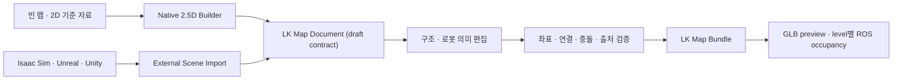

# ADR-0002: Native Builder와 외부 장면 Import를 함께 지원하는 맵 저작

| 항목 | 값 |
| --- | --- |
| 상태 | Accepted — 방향 결정 |
| 결정일 | 2026-07-19 |
| 결정 대상 | LK 맵의 직접 저작, 외부 3D 도구 연계, 재가져오기와 파생 export의 공통 경계 |
| 계약 성숙도 | Draft — `LK Map Document`와 `LK Map Bundle`은 아직 공개 API가 아님 |

## 결정

LK의 맵 저작은 다음 두 진입 경로를 모두 공식 방향으로 채택한다.

1. **Native Builder:** 웹에서 빈 맵 또는 2D 기준 자료로 시작해 로봇 운용에
   필요한 2.5D 구조와 의미를 직접 만든다.
2. **External Scene Import:** Unity, Unreal Engine, NVIDIA Isaac Sim 또는 DCC에서
   만든 공간을 가져와 좌표·층·객체를 매핑하고 로봇 의미를 완성한다.

두 경로는 별도 제품이나 별도 저장 모델이 아니다. 하나의 제안된
renderer-neutral `LK Map Document`와 같은 검증·변경·export pipeline으로
합류한다.



이 결정의 “양방향”은 직접 제작과 외부 제작을 모두 지원한다는 뜻이다. 엔진의
모든 material, shader, Blueprint, `MonoBehaviour`, simulation component를 손실 없이
상호 변환한다는 뜻이 아니다. 최초 지원 목표는 **공통 구조·transform·안정 ID와
로봇 의미의 제한된 왕복**이다.

## 현재 상태와 이 결정이 필요한 이유

현재 `apps/docs/src/map-editor-model.ts`의 `MapEditorDocument` schema version 2는
Storybook 상호작용을 검증하기 위한 in-memory fixture다. site/building/level 구조,
box·column·GLB asset, route polyline, area polygon과 goal을 직렬화하지만 다음 계약은
없다.

- 외부 장면 출처, adapter와 tool version
- source entity와 LK entity의 안정된 binding
- source hash, revision과 재가져오기 기준점
- door, lift, charger, dock과 waypoint-edge navigation graph
- imported/native 소유권, 잠금과 override
- 파생 GLB·occupancy의 출처 관계
- unknown field 보존, schema migration과 3-way diff

따라서 현재 fixture를 그대로 production schema나 `LK Map Document v1`로
승격하지 않는다. 검증된 immutable data, 명시적 `levelId`, deterministic
serialization과 한 제스처-한 commit 원칙만 후속 계약의 입력 근거로 사용한다.

현재 public `SpatialStructure`도 floor/wall/object를 box/cylinder primitive로
표현하는 foundation이며 완성된 2.5D 건축 모델이 아니다. 특히 현재 Story의 box
배치는 벽 저작 UX의 기준이 아니다. 벽과 route를 짧은 block의 연속으로 설치하는
표현은 채택하지 않는다.

## 공통 맵 의미

제안하는 `LK Map Document`는 하나의 JSON 파일 이름보다 넓은 논리 계약이다. 최소
다음 역할을 분리한다.

| 역할 | 내용 | 정본 여부 |
| --- | --- | --- |
| 문서 identity와 공간 기준 | schema version, document/entity ID, 우수계·Z-up·meter·radian, origin과 frame | 정본 |
| editable structure | site, building, level, floor boundary, wall polyline, opening/door, level transition, native primitive와 asset instance | 지원되는 공통 subset의 정본 |
| robot semantics | waypoint-edge navigation graph, direction·width·제약, area, goal, charger, dock과 facility binding | 정본 |
| external scene binding | source document/tool/version/hash, durable source ID 또는 weak path binding, LK `EntityId`, import transform, per-field ownership과 이전 normalized base | 정본 |
| engine-authored scene | 고복잡도 mesh, hierarchy, instance, collision/physics와 engine-native resource | 외부 장면 또는 USD가 정본 |
| derived output | 브라우저 preview GLB, level별 occupancy PNG/YAML, runtime 최적화 결과 | 비정본 cache; 선언된 source/toolchain/profile이 있을 때 재현 가능 |

저작용 `route`는 waypoint/edge 관계를 가진 영속 navigation graph다. runtime
`PathEntity`는 로봇이 실행하거나 관측 중인 경로다. 두 계약을 같은 이름이나
state machine으로 합치지 않는다. 공통 `area`와 제품 업무 `zone`도 같은 방식으로
구분하며, 제품별 permission·operation rule은 document extension 또는 제품 schema가
소유한다.

2D reference 이미지와 파생 occupancy raster의 좌표 의미는 이 ADR에서 재정의하지
않는다. 이미지 pixel `(0, 0)`은 원본 이미지의 좌상단이고 `rowFromTop`은 아래로
증가한다. level/grid 공간은 Y-up이라 occupancy cell `row 0`이 최소 Y 행이며, 두
공간은 row flip(`cell.row = heightCells - 1 - pixel.rowFromTop`)으로 연결된다.
보정된 anchor pixel은 meters-per-pixel과 origin·yaw를 담은 `gridToFrame`으로
metric level pose에 매핑되고, ROS occupancy YAML은 lower-left origin(bottom-left
cell)을 쓴다. 정본 규칙은 [SPATIAL_PRIMITIVES_GUIDE.md](SPATIAL_PRIMITIVES_GUIDE.md)의
`Asset and coordinate boundary`를 따른다.

## `LK Map Bundle` 목표 구조

`LK Map Bundle`은 npm package가 아니라 맵 교환을 위한 논리적 파일 묶음의 작업
명칭이다. 파일명과 JSON schema는 contract-only 단계에서 별도로 versioning한 뒤
public API로 승인한다.

```text
lk-map/
  manifest.json                 # schema, 좌표, source/derived provenance와 export profile
  map.json                      # 공통 editable structure와 robot semantics
  scene/
    scene.usd                   # 권장 authoring interchange; 있을 때만 포함/참조
  layers/
    lk-authoring.usda           # 선택적 non-destructive USD override
  derived/
    web-preview.glb             # 브라우저 runtime 전달용
    occupancy/
      <level-id>.png
      <level-id>.yaml           # ROS용 파생 결과
```

Unity project, Unreal project와 Isaac workspace 같은 engine-native 원본은 이
bundle 밖에 있을 수 있다. `manifest.json`은 해당 source revision을 참조하고
검증할 수 있어야 하지만, engine project 전체를 LDS3D asset 저장소가 소유하지
않는다. Derived artifact마다 source artifact hash, adapter/generator 이름과 version,
export profile과 생성 매개변수를 기록한다. Occupancy에는 최소 resolution, origin,
level/Z range, collision source와 occupied/free/unknown threshold가 필요하다. 원본이나
해당 toolchain을 사용할 수 없으면 cache를 표시할 수는 있어도 재생성을 보장하지
않는다.

기존 `AssetManifestV1`과 GLTF loader는 GLB/glTF runtime asset 전용이다. USD를 그
manifest에 추가하거나 renderer가 USD를 직접 읽는다고 가정하지 않는다. optional
importer 또는 별도 adapter/CLI가 USD와 engine export를 공통 document 및 파생 GLB로
정규화한다.

## Native Builder 범위

Native Builder는 Blender, Unity 또는 Unreal의 범용 mesh/material editor를 웹에
복제하지 않는다. 빠른 로봇 맵 구축과 현장 수정에 필요한 다음 2.5D 작업을
목표로 한다.

- level 생성, elevation과 local frame 설정
- 2D 기준 이미지 또는 occupancy를 잠금 reference로 배치
- floor boundary를 polygon으로 그리고 필요한 표면을 생성
- wall centerline을 연속 polyline으로 그린 뒤 thickness와 height를 속성으로 적용
- wall에 opening/door를 부착하고 level 사이 lift/transition을 연결
- waypoint와 edge로 route graph를 만들고 방향, 폭과 제약을 속성으로 편집
- keepout, speed-limited 등 navigation area와 goal을 polygon/pose로 저작
- charger, dock과 카탈로그 asset을 ghost preview와 snap으로 배치
- grid·vertex·surface snap, 마지막 점 취소, 명시적 완료, undo 가능한 원자 commit
- 좌표, 연결 단절, 중복 ID, 범위, 충돌과 clearance를 구조화된 진단으로 확인

route의 주 시각은 중심선, vertex와 방향 화살표다. 폭은 속성이며 선택·검증 시
반투명 주행 corridor로 보조한다. 고정 크기 block을 경로 본체로 사용하지 않는다.
wall도 box를 반복 배치하지 않고 연속 선을 기준으로 생성한다.

## External Import와 재가져오기

외부에서 가져온 geometry는 기본적으로 잠근다. 사용자는 좌표·단위·origin과
level mapping을 먼저 확인하고, 공통 의미를 매핑하거나 web-authored overlay를
추가한다. importer가 명확히 인식한 공통 floor/wall/door primitive만 사용자의
명시적 동의 후 editable structure로 변환할 수 있다. 여기서 “인식”은 mesh 형상이나
prim 이름 추론이 아니라 versioned LK mapping manifest와 `lk:` namespaced durable
entity metadata를 근거로 하며, 이 입력이 없으면 importer는 어떤 geometry도 editable
structure로 승격하지 않는다.

재가져오기는 원본 전체 덮어쓰기가 아니라 다음 순서를 따른다.

1. adapter가 source document ID, source hash, 가능한 경우 engine이 유지하는
   durable source entity ID와 `EntityId` binding을 읽는다.
2. durable ID가 없고 prim path나 hierarchy path만 있으면 binding을 `weak`으로
   표시한다. rename/reparent로 path가 사라지면 삭제로 자동 확정하지 않고
   `remap-required`로 보낸다.
3. 이전 normalized source base 또는 entity/field fingerprint, per-field
   source/web ownership과 tombstone을 저장하고 새 source와 3-way 비교해
   add/change/delete/unknown을 만든다.
4. web-authored structure·semantics와 같은 field를 source도 변경한 경우에만
   conflict로 분류한다. source에서 누락된 weak binding과 명시적 삭제를 구분한다.
5. 제품이 적용·유지·재매핑을 결정하고, LDS3D의 순수 merge/diff contract는 외부
   부작용 없이 새 immutable document 또는 unresolved result를 반환한다.
6. 알 수 없는 prim, metadata와 source hierarchy는 가능한 한 보존한다.

OpenUSD source는 reference/sublayer를 유지하고 web-authored 변경을 별도 강한
override layer에 기록한다. 편집 round-trip 중 stage flatten은 composition arc를
제거하므로 기본 경로로 사용하지 않는다. OpenUSD가 자체 GUID를 제공한다고
가정하지 않고 adapter가 `lk:entityId`에 해당하는 안정 ID를 명시적으로 기록한다.

### 서로 다른 세 가지 round-trip

다음 흐름을 하나의 “양방향 지원” 문구로 합치지 않는다.

1. **Source reimport:** external source → LK. 새 source revision을 이전 normalized
   base 및 web edit와 비교한다.
2. **Bundle round-trip:** LK Map Bundle 저장 → 동일 version/지원 migration으로
   재로딩. 모든 지원 adapter의 필수 계약이다.
3. **External write-back:** LK → external tool/source. adapter가 명시적으로
   지원하는 공통 subset만 쓰며 read-only adapter도 허용한다.

각 adapter는 `import`, `reimport`, `bundle-read/write`, `source-writeback`,
`derived-export` capability와 지원 schema/version을 선언한다. `source-writeback`이
없으면 LK sidecar를 저장할 수 있다는 사실만으로 외부 엔진이 해당 의미를 다시
읽는다고 주장하지 않는다.

| 수준 | 범위 | 초기 정책 |
| --- | --- | --- |
| Import/reimport | geometry, hierarchy, transform, 좌표 metadata와 알려진 semantic binding 읽기 | reference adapter 필수 |
| Bundle round-trip | LK structure/semantics/source binding을 저장하고 다시 읽기 | 필수 |
| External semantic write-back | LK route/area/goal/facility 의미를 tool이 읽는 sidecar/override로 쓰기 | adapter별 capability |
| External structural write-back | 지원되는 level/floor/wall/door/asset transform subset을 source 쪽에 쓰기 | 단계적·adapter별 capability |
| Visual round-trip | engine material, shader, Blueprint, `MonoBehaviour`, physics/sensor 전체 보존 | 보장하지 않음 |
| Derived reverse import | GLB 또는 occupancy로 원본 authored scene 복구 | 금지 |

위 세 흐름과 별개로, 2D reference/occupancy raster의 image → level → image 좌표
왕복은 adapter capability가 아니라 좌표 정본 fixture다. 모든 adapter와 Native
Builder reference calibration은 pixel → level pose → pixel 동일성을 복원하는
fixture와 ROS `cell ↔ dataIndex` 왕복을 포함하며, 규칙은
[SPATIAL_PRIMITIVES_GUIDE.md](SPATIAL_PRIMITIVES_GUIDE.md)의
`Asset and coordinate boundary`가 정의한다.

## 도구별 우선순위

| 도구 | 첫 역할 | 결정 |
| --- | --- | --- |
| Isaac Sim / OpenUSD | 로봇·충돌·시설 장면의 authoring source | 첫 reference importer와 golden fixture |
| Unreal Engine / USD | 고품질 시설 저작과 선택된 공통 metadata 교환 | 두 번째 adapter; GLB는 preview 파생물 |
| Unity | 기존 Unity 팀과 project를 위한 source | 공통 계약 뒤 전용 exporter/adapter 검토; experimental USD에 production 계약을 종속하지 않음 |

첫 golden fixture의 입력은 arbitrary mesh geometry나 name inference가 아니라
버전이 명시된(versioned) LK mapping manifest와 namespaced durable entity
metadata다. 여기서 LK mapping manifest는 자산 `AssetManifestV1`이나 bundle
`manifest.json`이 아니라 LK Map Document/Bundle의 mapping 계약을 가리킨다.
importer는 prim 이름이나 mesh 형상으로 semantic을 유추하지 않고 이 manifest와
`lk:` namespaced metadata로만 공통 primitive를 인식한다. scene-graph path/이름만으로
묶는 path-only binding은 durable identity가 아니라 weak이며 rename/reparent 시
remap-required가 된다.

엔진 SDK는 `core`, `assets`, `testing`, `three`, `r3f`에 들어가지 않는다. 공통
schema, 좌표 정규화, validator와 conformance fixture는 LDS3D 후보지만 실제 engine
plugin의 repository, release, version support owner는 구현 전에 별도 승인한다.

## UI anatomy와 소유권

2026-07-19 최종 read-only audit의 sibling LDS는
`C:\Users\MSI\Documents\LK Design System` revision
`a19d285651a98d3782f3cf306d8bfa51a366279c`, clean `main`, package
`@lk-robotics/design-system-core@0.1.0`이다. 첫 audit snapshot
`f8dd678f32c92798b05d7f97d84449dec916d3a4` 이후 변경은 LDS 문서에만 있었고 아래에
mapping한 public component, type, prompt, story, Storybook 설정과 token에는 diff가
없었다. 이 current snapshot은 root README가 기록한 재현 가능한 support pin을
대체하거나 새 visual-parity 증거가 아니다. LDS3D docs의 sibling `link:` dependency도
로컬 검토용이며 CI·배포 portability를 증명하지 않는다.

```text
product start flow
├─ 직접 만들기
├─ 2D 기준 자료에서 시작
└─ 3D 장면 가져오기
          ↓
LDS CanvasEditorShell
├─ header: document identity + import/reimport/export/save/history
├─ subheader: structure / semantics / validate mode
├─ tools: active mode의 편집 도구
├─ left region: FloorSelector + 실제 display layers
│              selectable structure tree는 LDS gap
├─ dominant viewport: embedded Scene3DFrame + actual WebGL
├─ panel: selected entity / tool draft / import review 중 하나
└─ status: frame/unit/snap/source/validation readout
```

Wide 읽기·키보드 순서는 document identity와 commands → editor mode → edit tools와
승인된 layer/hierarchy → dominant viewport와 viewport-local controls → task-appropriate
panel → passive status다.
Narrow에서는 `CanvasEditorShell.mobileActiveRegion`과
`responsiveNavigation`으로 scene, 승인된 layer/hierarchy, panel 중 하나만 주 영역으로
노출한다. import/reimport가 끝났다고 임의로 다른 영역으로 focus를 이동하지 않는다.

| Surface 또는 동작 | 소유자 |
| --- | --- |
| shell, document command bar, tool rail, display layer panel, viewport frame, selected-object inspector, file picker/queue, validation presentation, button/dialog, focus와 responsive behavior | LDS public component |
| coordinate/frame, spatial hierarchy와 primitive, actual WebGL/depth/picking, snap/rubber-band/ghost/transform 계산, pure normalization·validation·diff result | LDS3D |
| 시작 방식 선택, file I/O, upload/download, source registry, history, persistence, revision, permission, merge/conflict 정책, export destination와 ROS 배포 | 제품 |
| authored scene, engine-native hierarchy/material/physics/sensor와 native project lifecycle | Unity·Unreal·Isaac/DCC |

`CanvasEditorCommandBar`에는 import, reimport, export, save와 undo/redo 같은
document command를 둔다. orbit, pan, zoom, home과 focus는
`Scene3DFrame`의 `ViewerToolbar`에 둔다. `LayerPanel`은 visibility/lock을 가진
실제 display layer tree에만 사용한다.

`CanvasEditorCommandBar`에는 자동 overflow 계약이 없다. 좁은 폭에서 낮은
우선순위 document command는 제품이 public LDS `DropdownMenu`와 LDS action
trigger를 `CanvasEditorCommandBar.children`에 조합해 도달하게 하며 custom
overflow menu는 만들지 않는다. 폭을 감지해 command를 자동으로 접는 재사용
generic auto-overflow 동작은 LDS3D가 여기서 소유·구현하지 않는 별도 additive
LDS gap이며 이 ADR은 그 변경을 승인하지 않는다.

현재 LDS `CanvasEditorShell.layers`는 display layer용이며 public `Tree`는 controlled
selection, selected state, lock/visibility, unmapped/diff/validation 상태와 row action을
제공하지 않는다. 따라서 selectable site/level/object structure tree는 확인된 LDS
ownership gap이다. 생산 UI 전에 additive LDS structure slot/richer tree와
product-owned composition 중 하나를 별도 승인해야 한다. 이 ADR은 LDS 변경을 승인하지
않으며, LDS3D가 custom tree/panel을 만들어 gap을 우회하지 않는다.

`SelectionInspector`는 선택된 entity의 identity와 property에만 사용한다. active
tool/draft option, 좌표 보정, level mapping과 document validation은 shell-owned panel
안에서 public LDS form/action을 조합하는 product content다. selection mode에서 선택이
없을 때만 inspector empty state를 사용한다.

LDS3D validator는 blocking policy나 DOM을 소유하지 않고 구조화된 issue를
반환한다. Issue는 stable `id`, `code`, `severity`, `scope`, optional
`levelId`/`entityId`/`fieldPath`, optional scene-frame bounds와 deterministic order를
가진다. Severity와 제품의 save/export blocking policy를 분리한다. 제품은 정책을
결정하고 다음 owner에 결과를 매핑한다.

| 상태 | UI owner와 위치 |
| --- | --- |
| file 선택·upload·parsing 진행/실패 | Product orchestration + LDS `FileUploadQueue`/`ResourceState` |
| axis/unit/origin·2D scale·level mapping | Product review form using LDS fields/actions |
| unmapped entity·spatial warning·source lock | 구조화된 issue + non-colour WebGL cue + available list/tree + DOM summary |
| 선택 entity property | LDS `SelectionInspector` |
| renderer loading/unavailable/error | LDS `Scene3DFrame` state contract |
| 사용자 수정 가능한 blocking field | LDS field error + `ValidationSummary` focus link |
| reimport diff/conflict 적용 | Product-owned review/merge composition; LDS3D는 pure result만 제공 |

`ValidationSummary`는 일반 diagnostic log가 아니며, `ResourceState`와
`Scene3DFrame`의 상태를 중복 표현하지 않는다. 누락된 reusable DOM pattern이 있으면
LDS additive change 또는 product composition 결정을 먼저 하며 LDS3D에 임시
panel/button을 만들지 않는다.

Import review의 순서는 parsing → axis/unit/origin review → level mapping과 unmapped
review → locked-source preview+semantic overlay → ready/invalid다. Reimport는 제품이
적용하기 전 review-only diff에서 멈춘다. 2D reference는 source hash, active
`levelId`, meters-per-pixel, origin, yaw, opacity와 lock을 보정·기록한 뒤 tracing을
허용한다. Storybook은 실제 파일을 읽지 않고 각 상태를 seeded fixture로 검토한다.

320px/390px narrow acceptance는 다음을 포함한다. 모든 document command는
`CanvasEditorCommandBar`의 자동 overflow 없이 도달 가능해야 하며, 낮은 우선순위
command는 제품이 `CanvasEditorCommandBar.children`에 조합한 public LDS
`DropdownMenu`로 노출하고 hidden region은 tab order에서 제거한다.
Region 전환 trigger가 focus를 유지하며 canvas를 떠날 때 pointer capture는 commit 없이
끝나고 logical draft는 복귀 가능하게 보존한다. Tool rail은 canvas region과 함께만
노출하고 responsive navigation/status는 계속 도달 가능해야 하며 selection은 region
전환 전후 동기화한다.

### Visual delta inventory

LDS3D가 추가할 수 있는 시각 차이는 공간 정보에 한정한다: floor/wall geometry,
route centerline/corridor, area boundary/fill, direction glyph, source-lock cue, snap
marker, placement ghost, selection outline와 import diff overlay다. custom header,
button, tab, panel, drawer, status, typography, radius, border, shadow, focus ring과
별도 responsive grid는 만들지 않는다.

현재 Story의 모든 route segment에 항상 표시되는 opaque corridor plane과 독립 box
wall fixture는 migration debt다. 목표 증거는 기본 centerline+vertex+direction,
selection/validation에서만 보이는 translucent corridor, 그리고 하나의 polyline wall
identity에서 생성된 mesh다. 현재 화면이나 screenshot은 이 목표의 완료 증거가
아니다.

## 구현 단계

1. **A0 — Contract:** 용어, bundle manifest, `map.json` JSON Schema, coordinate
   profile, durable/weak binding, 이전 normalized base와 per-field ownership,
   tombstone, source/derived provenance, adapter capability, export profile,
   extension·migration·unknown-field 정책과 fixture를 승인한다.
2. **A1 — Unified model:** Story-local V2와 public spatial foundation에서 검증된
   패턴만 승계해 production document model을 새로 만들고 native/imported 소유권,
   polygon floor, polyline wall, door/lift, waypoint-edge graph, area/goal/charger/dock을
   정의한다.
3. **A2 — Golden vertical slice:** 한 level의 polygon floor, polyline wall과
   waypoint-edge route를 Native Builder와 동등한 Isaac/OpenUSD import fixture로
   만들고 같은 document, diagnostics와 derived preview를 검증한다.
4. **A3 — Native expansion:** door/lift, navigation area, goal, charger/dock,
   catalog asset과 2D reference calibration을 기존 draft, snap, gizmo 및 immutable
   commit boundary 위에 추가한다.
5. **A4 — Import expansion:** axis/unit/origin review, level mapping, unmapped/source
   lock 상태를 완성하고 Unreal, Unity 순으로 adapter capability를 추가한다.
6. **A5 — Reimport:** durable binding은 3-way add/change/delete/conflict를,
   path-only weak binding은 remap-required를 만들고 web semantic overlay,
   tombstone과 unknown data를 보존하는 fixture를 검증한다.
7. **A6 — Export:** 공통 subset USD/override, web GLB와 level별 ROS occupancy를
   명시한 source revision, generator version과 export profile에서 파생하고
   adapter별 source-writeback capability를 따로 검증한다.
8. **A7 — Product integration:** 제품이 file workflow, 저장, permission, revision,
   conflict UI와 배포를 연결하고 실제 consumer fixture로 검증한다.

A2가 native/import 양쪽으로 통과하기 전 A3/A4를 public alpha 범위로 묶지 않는다.
A5의 자동 merge는 durable binding, normalized base, tombstone과 unknown
preservation fixture가 통과하기 전 활성화하지 않는다.

## Storybook 경계

Storybook은 다음 계약만 실제 WebGL과 in-memory fixture로 검토한다.

- native floor/wall/route/area/goal/asset gesture와 accessible DOM 대안
- imported scene의 좌표 정규화, source-lock과 semantic overlay
- 결정적인 import validation과 add/change/delete/conflict diff fixture
- 동일 document의 GLB preview와 occupancy 파생 provenance 요약

실제 file picker workflow, engine 실행, upload/download, 저장소, revision 승인,
권한과 conflict 적용 화면을 제품처럼 흉내 내지 않는다. 기술 Story가 import/export
버튼이나 custom product chrome을 만들지 않는다고 해서 공통 exchange contract까지
범위 밖이라는 뜻은 아니다.

## 검토한 대안

### Native Builder만 제공

간단한 현장 맵에는 빠르지만 고품질 시설·자산 배치를 웹에서 다시 만들게 하고
Unity/Unreal/Isaac의 기존 작업을 활용하지 못하므로 채택하지 않았다.

### External Import만 제공

큰 시설에는 적합하지만 작은 맵, 현장 긴급 수정과 로봇 의미 저작까지 외부
엔진에 종속시키므로 채택하지 않았다.

### GLB 하나를 편집 정본으로 사용

브라우저 전달에는 적합하지만 authoring layer, source provenance와 로봇 의미의
완전한 왕복을 보장하지 못하므로 파생 preview로 제한한다.

### Occupancy PNG/YAML을 왕복 원본으로 사용

벽·문·자산·ID·material과 graph 의미를 복구할 수 없으므로 navigation 파생물로만
사용한다.

### 두 경로가 각자 schema를 유지

기능과 validator가 분기되고 같은 맵이 출처에 따라 다른 의미를 갖게 되므로
채택하지 않았다.

## 결과와 후속 결정

이 결정으로 현재 map-building Story의 block 중심 fixture가 완성 제품 방향으로
고정되지 않는다. 현재 구현은 draft/snap/transaction과 실제 WebGL 상호작용의
증거이며, production document와 wall/navigation graph/import 계약은 A0/A1에서
별도로 설계한다.

다음은 이 ADR이 승인하지 않는다.

- engine plugin의 repository와 배포 owner
- production schema의 정확한 package명과 public export
- Unity/Unreal/Isaac project 수정 또는 plugin 설치
- 제품 application routing, backend, storage, permission, command와 배포 변경
- 범용 CAD, mesh/material/UV/animation editor
- engine-native component와 visual fidelity의 완전한 왕복
- live simulation control, Pixel Streaming 또는 ROS bridge 운영

마지막 항목은 파일 기반 맵 저작 교환과 다른 runtime integration 문제이며 별도
후속 계획과 안전 검토를 따른다.

## 기술 근거

공식 포맷·도구 근거와 각 근거가 계약에 미친 영향은
[TECHNICAL_REFERENCES.md](TECHNICAL_REFERENCES.md)의
`Map document and external scene exchange (P2)`에 기록한다. 직접 저작 제스처와
LDS composition 경계는
[SPATIAL_PRIMITIVES_GUIDE.md](SPATIAL_PRIMITIVES_GUIDE.md)를 따른다.
