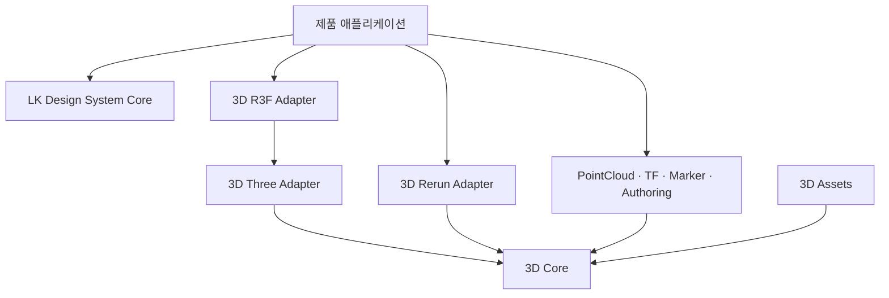

# LK Design System 3D 공식 플랫폼 아키텍처

- 상태: 공식 채택(Official Go)
- 대상: `lkrobotics-control-full`, `lk_web_viz`, 향후 3D 기반 제품
- 의사결정: LK Design System의 형제 레포이자 LK Robotics의 공식 범용 3D 플랫폼으로 즉시 구축한다. 두 제품 적용은 레포 존속 여부를 판단하는 파일럿이 아니라, 표준 API와 마이그레이션 품질을 검증하는 첫 공식 롤아웃이다.

## 1. 미션

LK Design System 3D는 로봇·지도·시설·포인트클라우드를 화면에 표시할 때 제품마다 반복되는 **공간 계약, 상호작용 규칙, 렌더러 연결 방식**을 표준화한다.

이 레포는 또 하나의 UI 디자인 시스템이나 자체 3D 엔진이 아니다. 다음 결과를 책임지는 검증 가능한 공식 공통 계층이다.

- 같은 pose와 asset이 제품 및 렌더러가 달라도 같은 위치·방향·크기로 보인다.
- 카메라, picking, selection, path, robot marker의 의미와 이벤트가 일관된다.
- Three.js, React Three Fiber(R3F), Rerun의 차이가 제품 업무 코드로 누출되지 않는다.
- 3D 리소스의 로딩, 오류, 해제, 성능 진단에 공통 기준이 생긴다.
- 제품은 기존 화면을 한 번에 재작성하지 않고 계층별로 도입할 수 있다.

### 플랫폼 운영 원칙

다음 원칙은 선택적 승격 조건이 아니라 모든 구현과 제품 롤아웃에 적용하는 필수 규칙이다.

1. **Platform First:** 두 제품과 향후 제품의 신규 공통 3D 기반 기능은 제품 내부 유틸리티보다 이 플랫폼에 먼저 구현한다.
2. **Single Contract:** 좌표, asset, camera, picking, entity 의미는 `3d-core` 계약을 단일 source of truth로 사용한다.
3. **One Release:** 제품별 fork를 허용하지 않으며, Control Full과 Web Viz는 동일한 공식 package release를 소비한다.
4. **Incremental Migration:** 기존 화면은 계층별로 이관하되, 파일럿과 canary는 플랫폼 존속 여부가 아니라 동작·성능·마이그레이션 방법을 검증한다.
5. **Adapter Isolation:** renderer와 제품별 차이는 adapter 또는 제품 composition에 격리하고 core에 제품별 조건문을 추가하지 않는다.
6. **Measured Operation:** 좌표 정확성, bundle, load time, frame time, memory, GPU lifecycle을 release gate로 관리한다.

## 2. 시스템 경계

### LK Design System Core

LK Design System Core(실제 package 이름은 D-1에서 확인)는 다음을 계속 소유한다.

- 색상, 타이포그래피, 간격, 상태 등 기본 UI token
- 버튼, 패널, 툴바, dialog, status UI
- DOM 접근성, 키보드 탐색, focus 처리
- `Scene3DFrame`과 같은 viewport 외곽 UI

LK Design System Core는 이 레포에 의존하지 않는다.
`Scene3DFrame` 명칭과 현재 API는 D-1에서 실제 LDS repository·Storybook·기준
version으로 확인한다. 현재 LDS에 없거나 계약이 다르면 LDS의 additive component
또는 제품 composition으로 재분류하며 LDS3D가 LDS component를 복제하지 않는다.

### LK Design System 3D

이 레포는 다음을 소유한다.

- 좌표계, 단위, frame, transform, pose 계약
- camera, selection, picking, gizmo 이벤트의 공통 의미
- static asset instance, robot, path, goal, landmark, grid 등 공통 spatial
  primitive
- renderer capability와 lifecycle 계약
- GLB/glTF 등 asset의 metadata, 정규화, 검증 규칙
- Three.js, R3F, Rerun adapter와 공통 테스트 fixture
- 3D semantic role과 token schema의 정의; 구체 token 이름은 G-D0 전까지
  experimental draft

3D semantic token은 LK Design System Core의 기본 token을 제품 또는 docs
integration layer에서 resolved value로 해석해 전달한다. LDS3D package는 LDS
CSS variable 이름을 public API로 받거나 Core token 값을 복제해 독립적인 시각
체계를 만들지 않는다. 실제 token mapping과 기본 appearance는
[디자인·LDS 통합 상위 계획](DESIGN_AND_LDS_INTEGRATION_PLAN.md)의 G-D0 승인을
거친다.

### 제품 애플리케이션

제품은 다음을 소유한다.

- ROS, WebSocket, REST, 파일 업로드 등 데이터 수집과 transport
- 로봇 명령, 편집 권한, 업무 상태와 오류 정책
- 어떤 entity와 layer를 언제 보여줄지 결정하는 scene composition
- 제품별 모델, 지도, 사이트 데이터와 asset 배포
- 실시간 store, 동기화, 기록, 사용자 workflow
- 제품 환경에 맞춘 최종 성능 예산과 기능 저하 정책

## 3. 책임 매트릭스

| 영역 | LK Design System Core | LK Design System 3D | 제품 |
|---|---|---|---|
| UI 기본 token과 theme | 소유 | 참조 | 브랜드 설정 |
| viewport 외곽, toolbar, panel | 소유 | 통합 지점 제공 | 구성 |
| DOM 접근성·focus | 소유 | canvas 대체 이벤트 제공 | workflow 연결 |
| 좌표·단위·transform | 해당 없음 | 소유 | 입력 frame 선언 |
| camera·selection·picking 의미 | frame만 제공 | 소유 | 허용 동작 결정 |
| renderer lifecycle·resource 해제 | 해당 없음 | adapter가 소유 | host와 오류 처리 |
| robot·path·goal 등 primitive | 해당 없음 | 기본 구현 소유 | 데이터와 규칙 제공 |
| ROS/실시간 protocol | 해당 없음 | 해당 없음 | 소유 |
| asset schema·검증 도구 | 해당 없음 | 소유 | 원본·CDN·버전 운영 |
| scene composition·업무 로직 | 해당 없음 | 확장점 제공 | 소유 |
| 성능 계측 계약 | 해당 없음 | 공통 지표 제공 | 예산과 대응 소유 |

## 4. 공식 패키지 구성

패키지는 renderer를 사용하지 않는 계약에서 renderer별 구현으로 한 방향으로 의존한다.

| 패키지 | 책임 | 주요 의존성 |
|---|---|---|
| `@lk-robotics/design-system-3d-core` | frame, transform, pose, camera, entity, interaction, token type | 외부 3D/React 의존 없음 |
| `@lk-robotics/design-system-3d-assets` | asset manifest, loader 계약, 정규화, 검증 | `3d-core` |
| `@lk-robotics/design-system-3d-three` | Three scene host, primitive, asset registry, picking, material, dispose | `3d-core`, `3d-assets`, `three` peer |
| `@lk-robotics/design-system-3d-r3f` | Three 구현의 React binding과 hook/component | `3d-core`, `3d-three`, React/R3F peer |
| `@lk-robotics/design-system-3d-r3f-compat-v8` | 필요성이 승인될 때에만 만들 deprecated R3F 8 binding (현재 미구현) | `3d-core`, `3d-three`, React 18/R3F 8 peer |
| `@lk-robotics/design-system-3d-pointcloud` | point cloud buffer, colorization, LOD, streaming renderer 계약 | `3d-core`, renderer adapter |
| `@lk-robotics/design-system-3d-tf` | frame graph와 시간축 transform projection; ROS transport는 포함하지 않음 | `3d-core` |
| `@lk-robotics/design-system-3d-markers` | 범용 ROS Marker 계열, 대량 동적 marker와 projection adapter | `3d-core`, renderer adapter |
| `@lk-robotics/design-system-3d-rerun` | 공통 entity·transform·time을 Rerun archetype으로 투영 | `3d-core`, Rerun client |
| `@lk-robotics/design-system-3d-spatial` | Building, Floor, Site 공간 모델과 renderer primitive | `3d-core`, renderer adapter |
| `@lk-robotics/design-system-3d-authoring` | selection, gizmo, snapping과 serializable change 계약 | `3d-core`, `3d-spatial`, renderer adapter |
| `@lk-robotics/design-system-3d-testing` | 좌표 round-trip, asset, adapter contract fixture | `3d-core`, `3d-assets` |

구현 순서는 P0의 `core`, `assets`, `three`, `r3f`, `testing`, P1의
`pointcloud`, `tf`, `markers`, `rerun`, P2의 `spatial`, `authoring`으로
고정한다. 수요 확인을 기다려 다음 영역의 착수를 결정하지 않으며, 각
단계에서는 API 형태와 제품 이관 순서만 조정한다. 모든 renderer와 선택
기능을 끌어오는 단일 거대 entry package는 만들지 않는다.

## 5. 의존 방향

아래 화살표는 “사용한다”를 뜻한다.



다음 역방향 의존은 금지한다.

- LK Design System Core → LK Design System 3D
- `3d-core` → React, DOM, Three.js, R3F, Rerun
- `3d-rerun` → Three.js 또는 R3F
- 공통 패키지 → 제품의 store, API, route, 업무 type
- 제품 상태에 `THREE.Object3D`, renderer handle 등 구현 객체 저장
- 제품 → `3d-three/r3f-bridge`; 이 adapter-only subpath는 `3d-r3f`
  implementation만 import

## 6. Renderer adapter 전략

`3d-core`의 entity, coordinate, camera, interaction 계약이 source of truth다. adapter는 이 의미를 각 renderer 방식으로 표현한다.

### Three.js

- imperative renderer와 기존 Three 기반 화면을 위한 기반 구현이다.
- geometry, material, raycasting, resize, context loss, cache와 `dispose`를 관리한다.
- renderer 좌표 변환은 이 경계에서 한 번만 수행한다.

### React Three Fiber

- React 제품의 기본 reference adapter다.
- `3d-three/r3f-bridge`의 승인된 factory, transform, resource 정책을 hook과
  component로 감싼다.
- R3F 전용 좌표 변환이나 별도의 primitive 의미를 만들지 않는다.
- Drei는 편의 구현으로 사용할 수 있으나 public contract로 노출하지 않는다.

### 표준 런타임 버전

- 현재 reference target은 **React 19.1.1, React Three Fiber 9.6.1, Three.js 0.185.1**다.
- `3d-three`와 `3d-r3f`의 Three peer 선언은 `>=0.185.1 <1`이며, reference
  implementation·CI·성능 기준선은 0.185.1에서만 검증한다.
- `lkrobotics-control-full`의 R3F 8 compatibility adapter는 실제 consumer
  smoke가 필요성을 입증하고 별도 ADR이 승인될 때에만 만든다. 만들어질 경우
  최초 공개부터 deprecated이며 신규 기능을 추가하지 않는다.
- Control Full의 canonical target 이관이 끝나면 compatibility adapter를
  제거하며, React/R3F의 영구 이중 트랙은 운영하지 않는다.

### Rerun

- 관측, 기록, 재생, 원격 진단을 위한 projection adapter다.
- 공통 entity ID, transform, timestamp, class를 Rerun archetype으로 변환한다.
- 편집, gizmo, browser picking을 반드시 제공할 필요는 없다.
- Three scene object를 변환하는 방식이 아니라 `3d-core`의 원본 의미 데이터에서 직접 기록한다.

각 adapter는 capability(`picking`, `editing`, `pointCloud`, `timeline`, `webgpu` 등)를 명시한다. 제품은 capability가 없을 때의 UI와 기능 저하를 결정한다. renderer 간 픽셀 동일성은 목표가 아니며, 좌표·entity 의미·상호작용 결과의 일치가 목표다.

## 7. 좌표 계약

좌표와 단위의 외부 기준은
[TECHNICAL_REFERENCES.md](TECHNICAL_REFERENCES.md)의 ROS REP-103, glTF 2.0과
Three.js 공식 문서를 따른다.

### 표준 공간

- public 공간 계산은 우수계(right-handed), Z-up을 기준으로 한다.
- 선형 단위는 meter, 각도는 radian이다.
- quaternion 순서는 `[x, y, z, w]`이며 항상 정규화한다.
- 로봇 local frame은 `+X` 전방, `+Y` 좌측, `+Z` 상방을 기본으로 한다.
- `Pose2D`의 yaw는 `+Z` 축 기준 반시계 방향이다.
- 시간 값은 숫자만 전달하지 않고 `timeline` 또는 clock domain과 단위를 함께 선언한다.

모든 pose와 transform은 `sourceFrame`과 `targetFrame`을 가진다. `Transform(source, target)`은 source 좌표를 target 좌표로 옮기는 변환이라는 방향을 고정한다. frame 정보가 없는 `[x, y, z]`를 package 경계에서 주고받지 않는다.

Three.js가 내부적으로 Y-up을 사용하거나 기존 화면이 부호 반전을 사용하더라도 변환은 adapter 또는 legacy importer 한 곳에 격리한다. 제품 component에서 `x, z, -y` 같은 변환을 반복하지 않는다.

### 필수 검증

- transform과 inverse의 round-trip
- pose → renderer → pose의 허용 오차 내 일치
- map origin 적용 전후 일치
- quaternion 회전 방향과 yaw fixture
- picking 결과가 표준 world frame으로 반환되는지 확인
- Three/R3F/Rerun에 동일 fixture를 넣었을 때 entity 위치와 방향의 의미 일치

축과 부호를 geometry 모양으로 추정하는 기능은 legacy asset 이관 도구에서만 허용한다. 표준 runtime은 명시적 metadata가 없으면 경고 또는 실패해야 한다.

## 8. Asset 계약

시각 asset의 기본 교환 형식은 glTF 2.0/GLB로 한다. URDF, PCD와 vendor 형식은 importer 또는 별도 streaming adapter가 표준 계약으로 정규화한다.

모든 asset은 파일 자체 또는 sidecar manifest에 다음 정보를 가져야 한다.

```json
{
  "schemaVersion": 1,
  "assetId": "robot.tron",
  "version": "1.0.0",
  "kind": "robot",
  "format": "glb",
  "fileFrame": "asset:robot.tron",
  "fileCoordinate": {
    "handedness": "right",
    "upAxis": "+Y",
    "forwardAxis": "+Z",
    "metersPerUnit": 1
  },
  "coreFrame": "base_link",
  "fileToCoreTransform": {
    "sourceFrame": "asset:robot.tron",
    "targetFrame": "base_link",
    "translation": [0, 0, 0],
    "rotation": [-0.70710678, 0, 0, 0.70710678]
  },
  "boundsInCoreMeters": {
    "frame": "base_link",
    "min": [-0.5, -0.4, 0],
    "max": [0.5, 0.4, 1.2]
  },
  "integrity": {
    "sha256": "..."
  }
}
```

`fileCoordinate`는 glTF 파일의 Y-up 공간과 unit을 설명한다. loader는 raw
position에 `metersPerUnit`을 적용한 뒤 `fileToCoreTransform`의 rotation과
translation 순서로 공용 Z-up `coreFrame`에 옮긴다. transform source는
`fileFrame`, target은 `coreFrame`이어야 하며 `boundsInCoreMeters`는 변환이
끝난 core frame의 bounds다. P0에서는 right-handed asset만 허용한다.

asset loader는
`idle/loading/ready/error/disposed`, progress, cancellation을 표현하고,
geometry·material·texture의 소유권과 해제 책임을 명시한다. load 결과는
caller가 dispose하거나 single-use ownership token으로 renderer host에
이전한다. 이전 뒤 caller dispose는 host resource에 영향을 주지 않고 token
재사용은 실패해야 한다. 화면 component가 로드된 scene을 직접 회전·scale하여
보정하지 않고 loader가 표준 frame으로 한 번 정규화한다.

Asset resource 등록과 scene placement는 분리한다. renderer host는 `assetId`로
resource를 등록하고, `AssetEntity`가 instance의 `EntityId`, pose, layer,
pickable/selectable 상태를 결정한다. 같은 asset의 여러 instance는
geometry·texture를 공유할 수 있지만 picking은 각 instance의 entity identity를
반환한다.

검증 도구는 최소한 schema version, 필수 좌표 metadata, bounds, 비정상 scale, texture 경로, LOD 순서와 파일 크기 예산을 검사한다. 실제 asset 파일과 CDN 운영은 제품 책임이며 이 레포는 대형 모델 저장소가 아니다.

## 9. 공식 구현 및 롤아웃 로드맵

### P0 — Platform Foundation

- `3d-core`, `3d-assets`, `3d-three`, `3d-r3f`, `3d-testing`을 공식 package로 구현하고 배포한다.
- 두 제품의 좌표 변환, camera, asset, picking 사용처와 현재 bundle, load time, frame time, memory를 기준선으로 기록한다.
- 대표 map, robot pose, path, GLB를 익명화 golden fixture로 고정하고 좌표 round-trip, asset 검증, adapter contract를 CI 필수 조건으로 만든다.
- camera rig, picking/selection과 renderer lifecycle을 reference implementation으로 제공한다.
- 두 제품이 동일 foundation alpha를 consumer CI에서 사용한다. Control Full은
  기존 경로를 authoritative하게 유지한 계산 전용 production shadow를
  완료하고 Web Viz는 fixture와 adapter skeleton을 완료한다.
- deprecated R3F 8 compatibility adapter는 Control의 visible renderer 연결에
  실제로 필요할 때만 publish하며 canonical target 이관 일정을 동시에 고정한다.

### P1 — Robotics Visualization

- `3d-pointcloud`, `3d-tf`, `3d-markers`, `3d-rerun` adapter를 공식 지원 범위로 구현한다.
- PointCloud의 buffer lifecycle, colorization, LOD, streaming과 WebGL/WebGPU capability를 표준화한다.
- TF frame graph, timestamp, interpolation 계약을 구현하되 ROS/WebSocket transport는 제품 경계에 유지한다.
- P0 Robot·Path·Goal·Landmark 위에 범용 ROS Marker shape, 대량 동적 update와
  renderer projection 계약을 추가한다.
- Rerun에는 공통 entity, transform, time, class를 직접 투영하고 Three/R3F object를 중간 계약으로 사용하지 않는다.
- Web Viz의 `PointCloudViewer`, `PcdMap3DPanel`, Rerun 기반 화면을 순차 이관한다.

### P2 — Spatial Authoring Foundation

- `3d-spatial`에 Building, Floor, Site의 hierarchy, frame, bounds와 renderer
  primitive를 구현한다.
- `3d-authoring`에 selection, gizmo, snapping과 serializable change
  contract를 구현한다.
- building, floor, site의 hierarchy, frame, bounds, visibility, selection을 공통 spatial model로 정의한다.
- 배치, 이동, 회전, 높이·층 관계를 renderer 비종속 authoring command와 undo 가능한 change set으로 표현한다.
- transform gizmo와 authoring overlay의 의미 계약을 제공하되 저장, 권한, 승인 workflow는 제품에 유지한다.
- Web Viz의 Building/Floor/Site 화면을 공통 authoring foundation으로 이관한다.
- CAD/GIS/digital twin 완제품으로 확장하지 않고 제품이 조합할 수 있는 저수준 spatial primitive와 편집 기반까지만 소유한다.

### 롤아웃 품질 게이트

다음 gate는 플랫폼 승격이나 존속 여부를 결정하지 않는다. 각 package release와 제품 rollout의 완료 조건이다.

- 두 제품에서 동일 fixture가 같은 world 결과를 낸다.
- 이관된 view component에 축·부호·단위·asset 보정이 남아 있지 않다.
- adapter 밖으로 renderer 객체가 누출되지 않는다.
- 기존 핵심 workflow, 명령 payload와 접근성에 회귀가 없다.
- 합의한 bundle/load/frame/memory 예산과 context-loss 복구 기준을 만족한다.
- canary 실패 시 제품 release를 rollback하되 공식 플랫폼 로드맵은 계속 진행하고 원인을 플랫폼 또는 adapter에서 수정한다.

## 10. 명시적 비목표

- Three.js, R3F, Rerun을 대체하는 자체 렌더링 엔진
- 완성형 CAD, GIS, SLAM, 시뮬레이터 또는 digital twin 플랫폼
- ROS client, 로봇 제어, backend, 실시간 store 제공
- 제품 업무 workflow와 권한 정책의 표준화
- 모든 기존 3D 화면의 일괄 재작성
- 모든 3D 파일 형식 지원 또는 대형 asset 저장·배포
- renderer 간 픽셀 단위 동일성
- metadata가 없는 asset의 runtime 자동 축 추정
- LK Design System Core의 UI component와 token 복제
- 제품 업무 로직과 저장·권한 정책을 3D라는 이유만으로 공통화

## 11. 변경 원칙

- public contract 변경은 semantic versioning을 따르고 migration 문서를 제공한다.
- P0/P1/P2의 공식 범위는 제품별 사용량과 무관하게 플랫폼 계약으로 구현하며, 범위 밖 abstraction은 ADR과 명확한 제품 소비 계획을 요구한다.
- renderer별 기능은 먼저 capability로 표현하고 core에 renderer type을 추가하지 않는다.
- 제품 예외가 생기면 공통 계약을 오염시키기보다 adapter extension 또는 제품 composition으로 해결한다.
- 아키텍처 gate에 영향을 주는 결정은 ADR로 기록한다.
